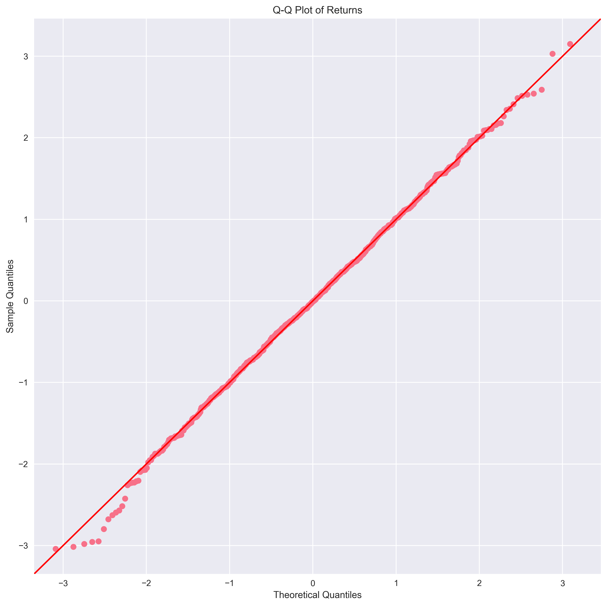
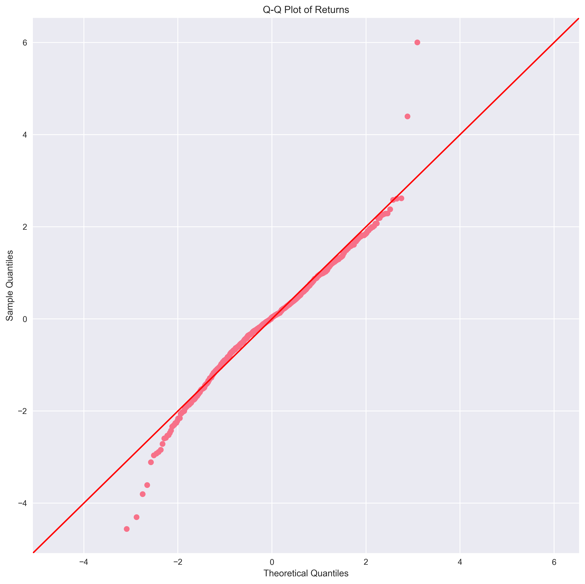
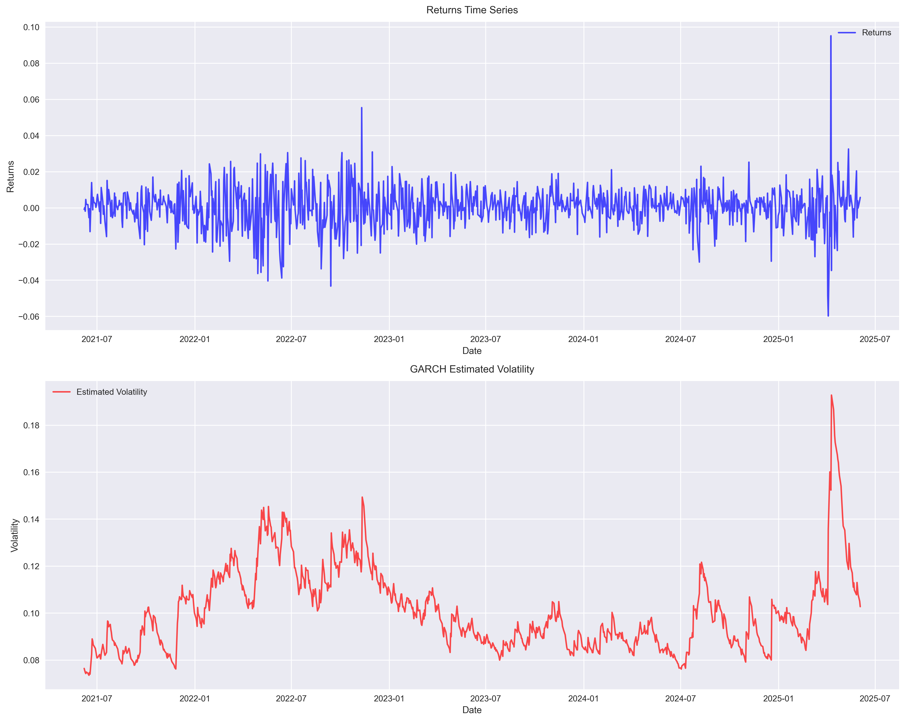

# Volatility analysis with the GARCH(1, 1) model

## Overview

We analyze volatility clustering in financial markets using GARCH (Generalized Autoregressive Conditional Heteroskedasticity) models. We specifically focus on the GARCH(1,1) model as it conveys the gist of the
large set of models in this family. Our analysis encompasses both simulated and real market data, with focus on volatility shock impacts and market behavior comparison.

## Setup

1. Create a virtual environment:
```bash
python -m venv venv
source venv/bin/activate
```

2. Install dependencies:
```bash
pip install -r requirements.txt
```

### Dependencies

- numpy: Numerical computations
- pandas: Data manipulation
- matplotlib: Plotting and visualization
- seaborn: Enhanced plotting
- arch: GARCH model implementation
- yfinance: Market data fetching
- statsmodels: Statistical analysis

### Running the Analysis

Run the main script:
```bash
python main.py
```

## GARCH(1,1) model

The GARCH(1,1) model is the most popular and studied model in the family of Conditional Heteroscedastic Models first proposed in the 1980s by Engle and Bollerslev.

Under this model the returns given by

$$
r_t = \sigma_t \epsilon_t~,\qquad \epsilon_t \sim \mathcal{N}(0,1)
$$

where $\sigma_t^2$ is the conditional variance which is given by:

$$
\sigma_t^2 = \omega + \alpha_1 r_{t-1}^2 + \beta_1 \sigma_{t-1}^2~.
$$

In this equation we have
- $\sigma_t^2$ is the conditional variance at time $t$
- $\omega$ is a constant 
- $\alpha_1$ is the ARCH parameter (impact of past returns)
- $\beta_1$ is the GARCH parameter (persistence of volatility)
- $r_{t-1}^2$ is the squared return from the previous period

For simulation purpose, we set the initial variance $\sigma_0^2$ to its long term average value
$$
\sigma_0^2 = \frac{\omega}{1-\alpha_1-\beta_1}~,
$$
which fixes $r_0$. This seeds the recursion that then generates the rest of the time series. 


## Analysis with simulation data I : GARCH (1,1) model

With the aforementioned initial condition we simulate a return series based on GARCH(1,1) model with the following model parameters
```
'omega': 0.05,   # Small constant term
'alpha': 0.15,   # Impact of past squared returns
'beta' : 0.80    # High persistence in volatility
```

Here is the plot of the resulting simulated data:


*Returns and Volatility for simulated GARCH(1,1) process with the above mentioned model parameters (no shock / no volatility bursts)*

In the simulated data we know the true volatility process that is shown in green above. In this controlled setting we then try to *fit* a GARCH(1,1) model with the data and compare the volatility process of the fitted model (in red) with the true process (in green). This is shown in the last plot above. The estimated model parameters are
```
Estimated GARCH parameters:
omega: 0.0412
alpha: 0.0900
beta: 0.8584
persistence: 0.9484
log_likelihood: -1264.2782
aic: 2534.5565
bic: 2549.2797
```

```
Volatility Estimation Statistics:
Mean Absolute Error: 0.102950
Root Mean Square Error: 0.122959
Correlation between True and Estimated: 0.980134
```


The return series has the following descriptive statistics
```
Return series statistics:
mean: 0.0072
std: 0.8811
skewness: 0.0440
kurtosis: 0.3594
min: -3.3109
max: 3.1140
```

Following is the plot of the return distribution and QQ plot.

*Returns Distribution for the simulated GARCH(1,1) process without shocks or volatility bursts*


*QQ plot for the returns in the simulated GARCH(1,1) process without shocks or volatility bursts*

We now analyze volatility clustering in this time series. This is done by the looking at the autocorrelation function of the absolute or squared returns. Following is the plot for the ACF of the squared returns. 


*Volatility Clustering in GARCH process*
```
Volatility Clustering Statistics:
Number of significant lags: 10 out of 20
First lag autocorrelation: 0.0362
95% Confidence bound: ±0.0620
Weak or no evidence of volatility clustering
```
We see that there is some evidence of volatility clustering in this return series -- 10 out of the first 20 lag values have statistically significant positive auto-correlation.

We now compare these plots against a *homoskedastic* time-series data where we do not expect any volatility clustering.

### Comparision with homoskedastic data where there is no volatility clustering

Following plot is generated by a normal distribution with $\sigma=0.02$


*Returns and Volatility for Homoskedastic Process*


*Returns distribution for Homoskedastic Process*


*QQ plot for returns in the Homoskedastic Process*


*No signs of volatility clustering in the Homoskedastic Process*

```
Volatility Clustering Statistics:
Number of significant lags: 3 out of 20
First lag autocorrelation: 0.0033
95% Confidence bound: ±0.0620
Weak or no evidence of volatility clustering
```

We see that the first lag autocorrelation here is much smaller than the simulated GARCH(1,1) data shown previously. The lack of statistically significant ACF values => there is no volatility clustering. 


## Analysis with simulation data II : GARCH (1,1) model + volatility burst

A volatility burst is a period of temporarily high volatility typically triggered by a large return shock. We'd like to understand how long this elevated volatility lasts and how fast it decays back to normal.

We now look at the simulation of GARCH(1,1) model in the presence of a shock in the volatility series at a specified time with a specified magnitude. The plot of the return series, true volatility series and the fitted GARCH(1,1) model volatility series is shown below. 


*Returns and Volatility for GARCH Process in the presence of a shock in the volatility time series*

The fitted model parameters are 
```
Estimated GARCH parameters:
omega: 0.0294
alpha: 0.0916
beta: 0.8792
persistence: 0.9709
log_likelihood: -1332.0613
aic: 2670.1225
bic: 2684.8458
```

Let also look the return statistics and distribution under the presence of a shock

```
Return series statistics:
mean: 0.0190
std: 0.9759
skewness: 0.3590
kurtosis: 2.5267
min: -4.5812
max: 5.4026
```

Comparing with the previous statistics we see the return are more skewed and have a higher kurtosis in the presence of shock. 


*Returns Distribution for the simulated GARCH(1,1) process in the presence of a shock in the volatility time series*


*QQ plot for the returns in the simulated GARCH(1,1) process in the presence of a shock in the volatility time series*

Following is the plot for the ACF of the squared returns. 

*Volatility Clustering in GARCH process in the presence of a shock in the volatility time series*

```
Volatility Clustering Statistics:
Number of significant lags: 15 out of 20
First lag autocorrelation: 0.0610
95% Confidence bound: ±0.0620
Weak or no evidence of volatility clustering
```
We observe that clustering is more pronounced in the presence of volatility shocks. 

### Analysis of shock impact


*Analysis of Volatility Shock Impact*


```
Shock Impact Analysis:
Pre-shock statistics:
Mean volatility: 0.7796
Max volatility: 1.0889

Post-shock statistics:
Mean volatility: 1.5699
Max volatility: 2.3665
Peak-to-pre-shock ratio: 3.04

Shock half-life: 0 days

Comparing GARCH persistence:

Pre-shock model:
Alpha: 0.0712
Beta: 0.8456
Persistence: 0.9168

Post-shock model:
Alpha: 0.0946
Beta: 0.8784
Persistence: 0.9731
```

`Persistence` is given by the sum $\alpha+\beta$ which determines how persistent volatility is: a value closer to 1 implies volatility decays slowly so that there are long-lasting burst. If $\alpha+\beta\ll 1$ then volatility decays exponentially.

## Analysis on S&P 500 

We collect 4 years worth of S&P 500 data till date. A look at its return histogram and the QQ plot shows that it deviates from the normal distribution in the tail regions. 




```
Return series statistics:
mean: 0.0004
std: 0.0113
skewness: 0.2025
kurtosis: 6.8658
min: -0.0597
max: 0.0952
acf_squared_returns: 0.1584
```

We fit this returns data to the GARCH(1,1) model and find the following estimates for the model parameters

```
Estimated GARCH parameters:
omega: 0.0000
alpha: 0.1000
beta: 0.8800
persistence: 0.9800
log_likelihood: 3195.7535
aic: -6385.5070
bic: -6370.7748
```
Below is the plot for the S&P 500 returns series data along with the plot for estimated volatility obtained from the fitted GARCH(1,1) model.



```
Estimated Volatility Statistics:
Mean: 0.101031
Std Dev: 0.017788
Min: 0.073535
Max: 0.192818
Median: 0.096859
```

Below is the plot for the ACF of squared returns which shows statistically significant positive correlation for small values of the lag. 


```
Volatility Clustering Statistics:
Number of significant lags: 7 out of 20
First lag autocorrelation: 0.1584
95% Confidence bound: ±0.0619
Strong evidence of volatility clustering (significant first-lag autocorrelation)
```

The theoretical form of the ACF for squared return in GARCH(1,1) is 
$$
\rho_\ell= \begin{cases}\frac{\alpha_1\left(1-\alpha_1 \beta_1-\beta_1^2\right)}{1-2 \alpha_1 \beta_1-\beta_1^2} & \text { if } \ell=1 \\[10pt] \rho_1\left(\alpha_1+\beta_1\right)^{\ell-1} & \text { if } \ell>1\end{cases}
$$

The ACF of squared returns in GARCH(1,1) model falls off exponentially (note that $\alpha_1+\beta_1<0$ which is required for stationarity of the time series). 

Observe that the value of lag-1 autocorrelation predicted by the model (which turns out to be $\rho_{1, \text{fitted-model}} = 0.2774$ after plugging in the fitted parameters into the above formula) is too high compared to what is observed in the data $\rho_{1, \text{data}} = 0.1584$. This is typical of GARCH models.  


## Things for the future

- EGARCH for asymmetric volatility 

- Analyse more real world market data 
   - CBOE Volatility Index (VIX), Options data, Historical Stock Prices
   - Analysis during crisis period 

- More advanced stuff ... 
   - Integration of real-time market monitoring
   - Automated shock detection
   - Study various risk metrics (Implied Volatility, Volatility of Volatility, VIX Index, Value-at-Risk, Maximum Drawdown, Expected Shortfall, Realized Skewness & Kurtosis)