# Implementation and analysis of the Heston model

## Overview

The Heston model is a popular stochastic volatility model used in mathematical finance to describe the evolution of asset prices. It was introduced by Steven Heston in 1993 to improve upon the Black-Scholes model by allowing volatility to be stochastic rather than constant.

Under the risk-neutral measure, the Heston model describes the asset price $S_t$ and its variance $v_t$ as:

$$
\begin{aligned}
d S_t & =r S_t d t+\sqrt{v_t} S_t d W_t^{(1)} \\
d v_t & =\kappa\left(\theta-v_t\right) d t+\sigma \sqrt{v_t} d W_t^{(2)}
\end{aligned}
$$

with:
- $S_t$ : asset price
- $v_t$ : instantaneous variance
- $r$ : risk-free rate
- $\kappa$ : rate of mean reversion
- $\theta$ : long-term mean variance
- $\sigma$ : volatility of volatility
- $W_t^{(1)}, W_t^{(2)}$ : two correlated Brownian motions with correlation $\rho$

This model captures some of the emperically ovserved features in return series: 

- fat-tailed returns
- volatility clustering 
- mean reversion (variance tends to revert to a long-term level $\theta$)
- leverage effect that is captured via negative correlation $\rho<0$ between price and volatility.
- Implied Volatility Smile/Skew 

In our implementation here we explore some of these feature of the model and also price European Call/Put options using the characteristic function as well Monte Carlo.

## Repo Structure

```
HestonModel/
├── src/
│   ├── heston_model.py      # Core model implementation
│   ├── heston_pricing.py    # Option pricing methods
│   └── main.py             # Analysis scripts
├── figures/                # Generated visualizations
│   ├── price_and_vol_paths.png
│   ├── volatility_clustering_*.png
│   ├── mean_reversion.png
│   ├── sensitivity_*.png
│   └── implied_volatility_surface.png
└── requirements.txt       # Project dependencies
```

## Model Analysis

### Base Parameters and Conditions
We set the model parameter to be as follows:
- Mean reversion speed ($\kappa$): 1.20
- Long-term variance ($\theta$): 0.10 (31.6% volatility)
- Volatility of variance ($\sigma$): 0.30
- Correlation ($\rho$): -0.80
- Initial variance ($v_0$): 0.10
- Drift rate ($\mu$): 0.1

These parameters satisfy the Feller condition ($2\kappa\theta \geq \sigma^2$) that ensures the variance process remains strictly positive throughout in the simulations for which we use full truncation scheme. (However we make a note that Feller condition is hardly satisfied when calibrating the model). 

## 2. Price and Volatility Paths Analysis

### Simulation Parameters
- Number of paths: 1000
- Time steps: 1250
- Time horizon: 5.0 years

### Price and Volatility Paths

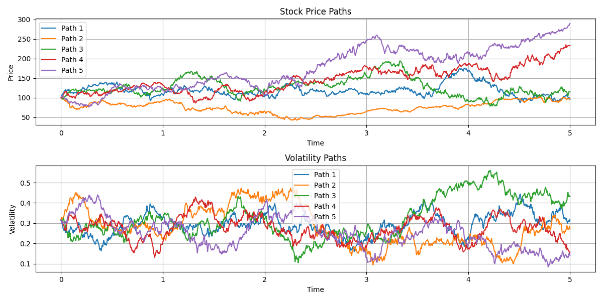

The figure shows multiple sample paths of Price (top panel) and Volatility (bottom panel). Notice that the variance process is strictly positive. This due to the Feller condition + full truncation scheme that sets negative values of the variance to zero. Even though we are imposing Feller condition negative values can still arises due to descretization error. 

## 3. Volatility Clustering Analysis

Volatility clustering is quantitatively measured through the auto correlation function (ACF) of the absolute returns or squared return. The existence of clustering is seen as strong positive ACF for small values of lag which decays eventually. In the following plot we pick a sample path and plot its ACF.

### Single Path ACF Analysis

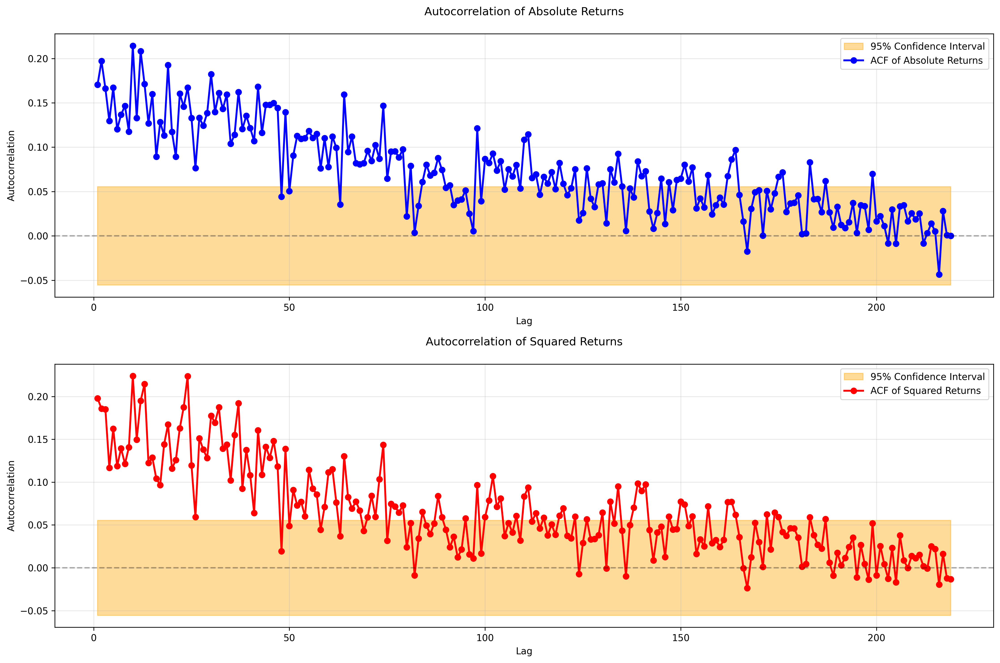

The figure above shows the ACF analysis of returns for a single path. The top panel displays the ACF of absolute returns, while the bottom panel shows the ACF of squared returns. The orange shaded region represents 95% confidence interval. We see strong autocorrelation in both the plots. 

We can also compute the statistical average of the ACF (for fixed value of the lag) over all the paths. The result is shown in the plots below.

### Path-Averaged ACF Analysis

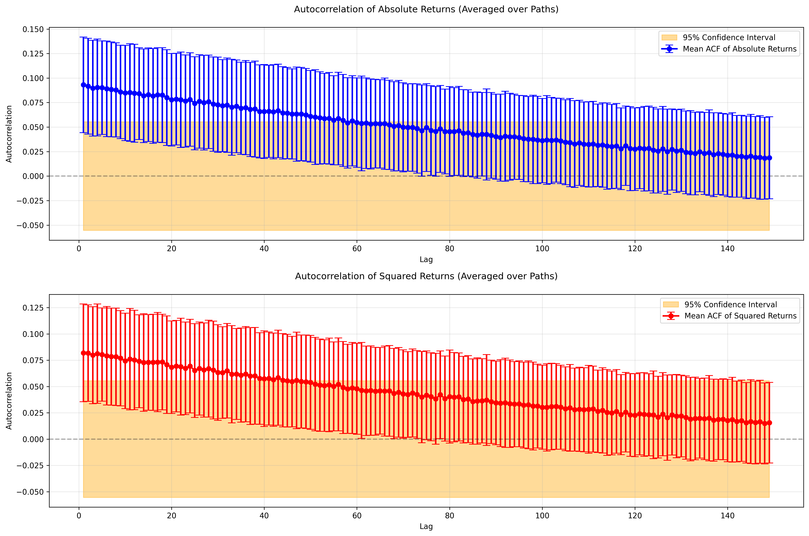

The figure above shows the ACF analysis averaged across all simulated paths this again depicts volatility clustering.


In the following plots we analyse the decay of the ACF of absolute and squared returns w.r.t. the lag and find that the exponential function $\sim e^{-0.01 \ell}$ fits it well. 


### Volatility Decay Analysis

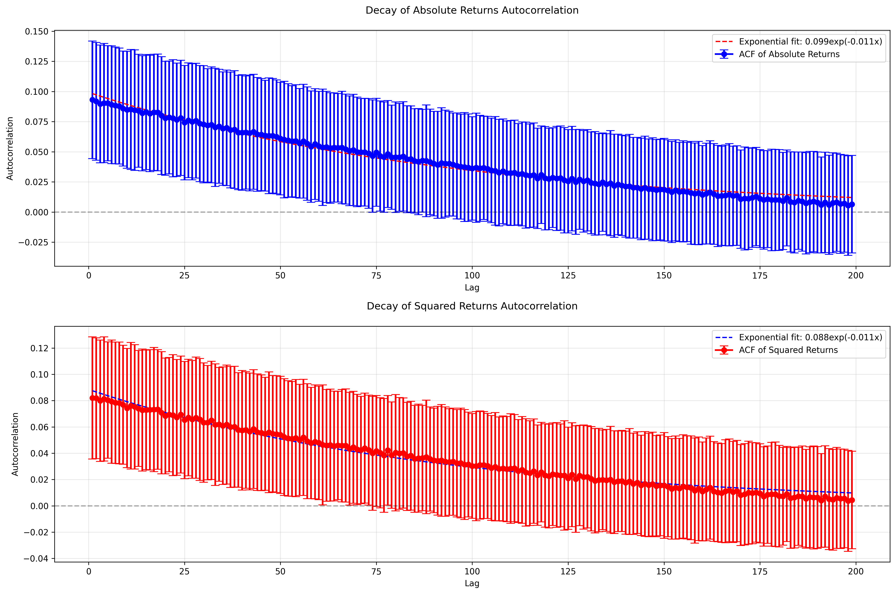
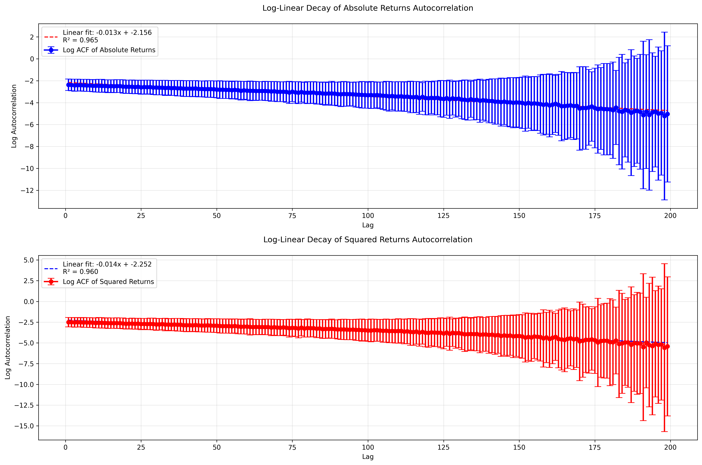

The exponential fall-off of these auto correlations observed in the Heston model is too fast compared to real financial time series where the decay is observed to be power law in the lag $\sim \ell^{-\alpha}$ indicating long memory. This is one of the limitations of the Heston model which is addressed by the rough volatility models. We discuss this point further in the `RFSV model` module. 

## 4. Leverage Effect

The leverage effect is a well-known empirical phenomenon observed in financial markets (especially in equity markets). It states that when stock prices drop, volatility tends to increase. Conversely, when stock prices rise, volatility tends to decrease (but the effect is weaker). This is schematically shown in the plot below

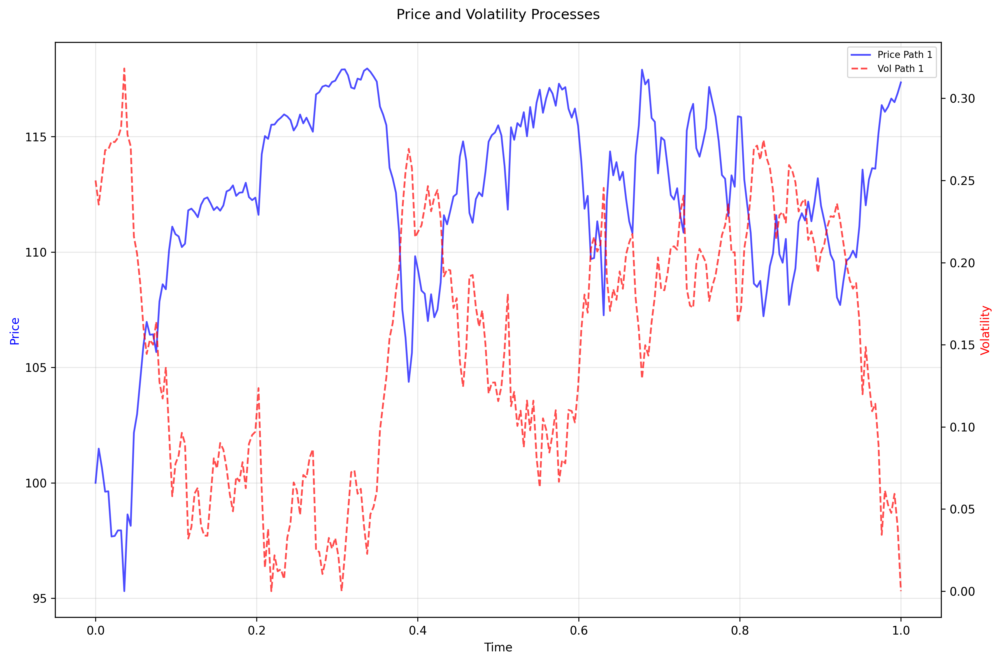
*An increase in the volatility is accompanied by a decrease in the asset price and vice versa*


More formally, the leverage effect refers to a negative correlation between returns and future volatility. Mathematically, the correlation between past returns and future volatility (or variance) is negative:

$$
\text{Corr}\left(r_t, \sigma_{t+\tau}^2\right)<0 \text { for } \tau>0
$$

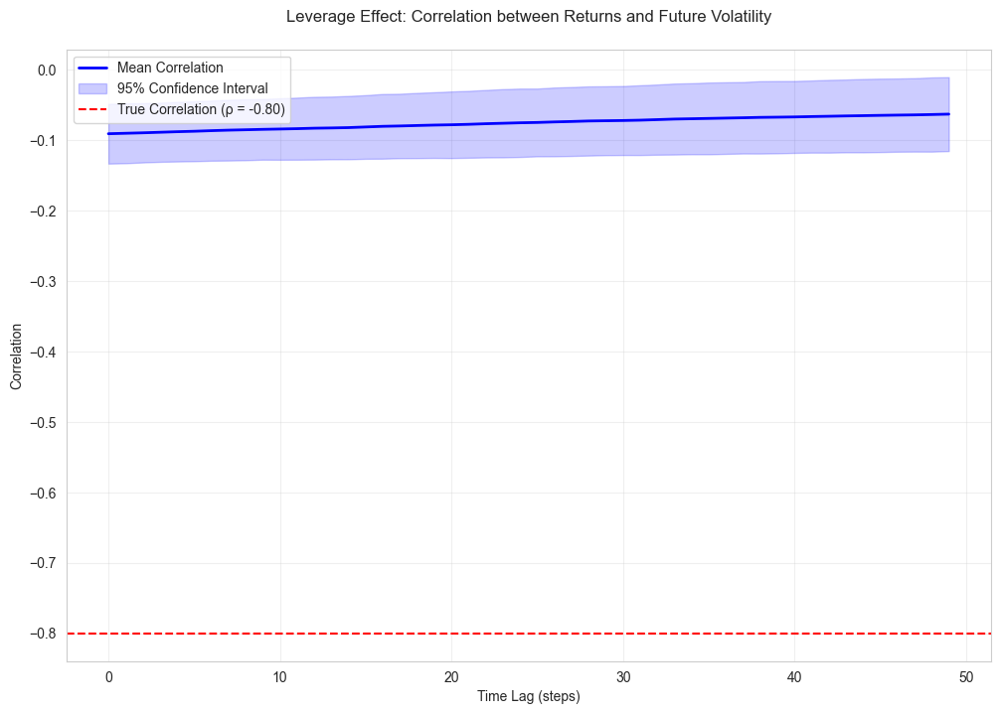

*Exponentially decaying correlation between past returns and future volatility as function of the time lag between the two series. The sign of the correlation is given by the sign of $\rho$*

Below we plot and compare the distribution of final prices for a positive and a negative value of rho. 
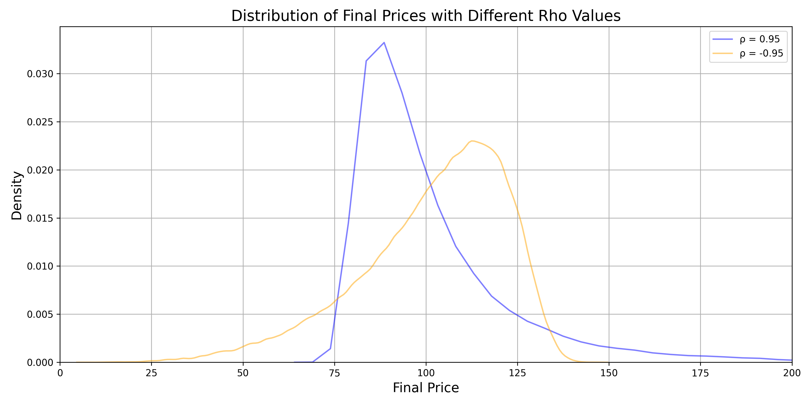

Distribution of final prices with different rho values. We see that there are long tails in the distribution of the final price in the negative (positive) direction for negative (positive) values of the correlation $\rho$.


## 5. Mean Reversion Analysis

### Mean Reversion Visualization

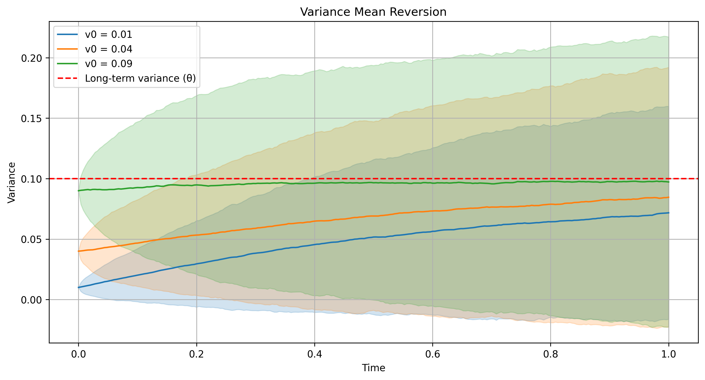

The figure above illustrates the mean reversion behavior of the variance process. Three different initial variance levels are shown (0.01, 0.04, 0.09) and we see that each of them converge to the long-term variance level of 0.1. The shaded regions represent 95% confidence intervals

Numerical Results:
- Theoretical κ: 1.20
- Estimated κ: 1.18
- Estimation error: 1.67%

## 6. Sensitivity on model parameters

### Sensitivity Plots

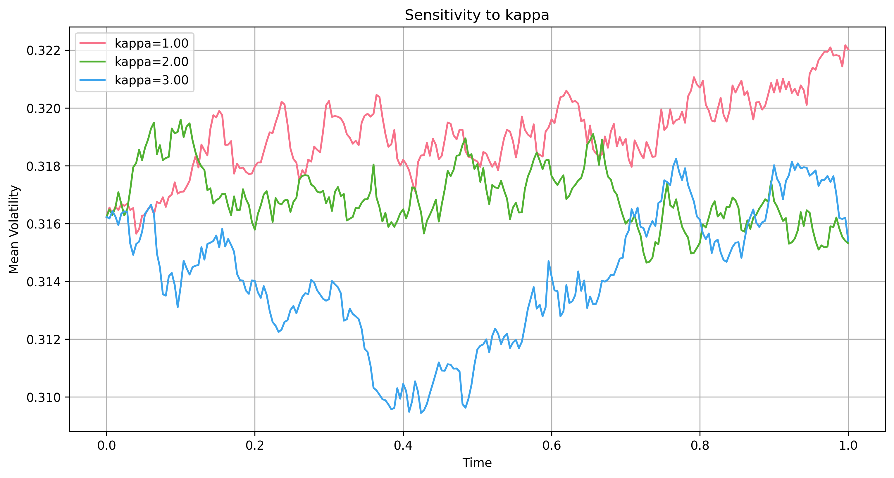
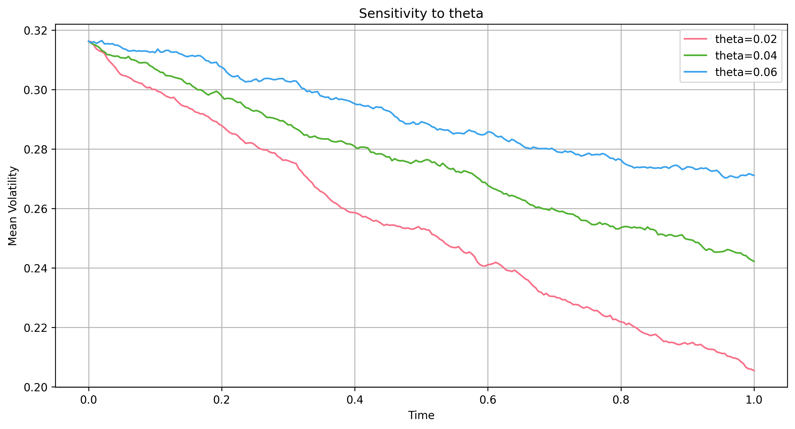
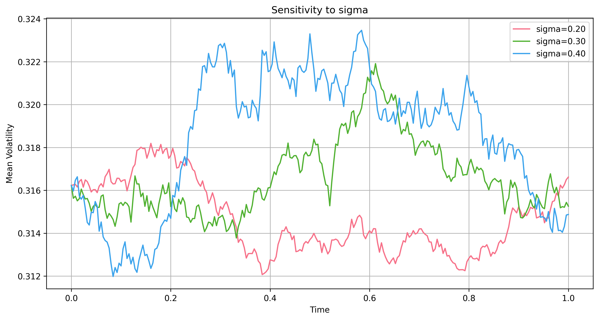

The three figures above show the sensitivity of the model to changes in key following parameters:

1. **Mean Reversion Speed (κ)**: We observe faster convergence with higher $\kappa$ values
   
2. **Long-term Variance (θ)**: Different convergence levels for each $\theta$

3. **Volatility of Variance (σ)**: More volatile paths with higher $\sigma$


## 7. Option Pricing Analysis

Here we price a European Call/Put option under the Heston model via two independent procedures:

1. Characteristic function method
2. Monte Carlo simulation 

The characteristic function of the Heston model is given by

$$
\phi(u, t)=\exp \left[i u \mu t+\frac{\kappa \theta}{\sigma^2}\left((\xi-d) t-2 \ln \left(\frac{1-g_2 e^{-d t}}{1-g_2}\right)\right)+\frac{v_0}{\sigma^2}(\xi-d) \frac{1-e^{-d t}}{1-g_2 e^{-d t}}\right]
$$
where
$$
\xi=\kappa-\sigma \rho u i, \quad d=\sqrt{\xi^2+\sigma^2\left(u^2+i u\right)}, \quad g_2=\frac{\xi-d}{\xi+d}
$$

In terms of the characteristic function, the price of the European Call option is given by

$$
C = S_0 Q_1 - e^{-rt} K Q_2
$$

where $Q_1$ and $Q_2$ are given by

$$
Q_1 = \frac{1}{2}+\frac{1}{\pi}\int_0^\infty du ~\Re\left(\frac{e^{-i u \log \left(\frac{S_0}{K}\right)}}{iu}\frac{\phi (u-i)}{\phi (-i)}\right)~,
$$
$$
Q_2 = \frac{1}{2}+\frac{1}{\pi}\int_0^\infty du ~\Re\left(\frac{e^{-i u \log \left(\frac{S_0}{K}\right)}}{iu}\phi (u)\right)~.
$$

The price of the put option can be obtained from the put-call parity given by $P = C - S_0 + K  \exp(-r  T)$. 

In the monte carlo simulation we use the descretization procedure with the full truncation scheme that sets any negative value of the variance process to zero. In this case we simply read-off the end price of the $S_t$ process then setting

$$
C = e^{-rt}\mathbb{E}\left[(S_0-K)^+ \right]~
$$

The expected value is computed by an average over all the paths. 

In the following plot we compare the answer from the two methods for the given model and simulation parameters. The risk free rate used was $r=0.05$ and time to maturity $T=5$ yr. Pricing using the Heston characteristic function gives

```
Call Price: 36.7347
Put Price: 14.6148 
```


### Pricing Methods Comparison

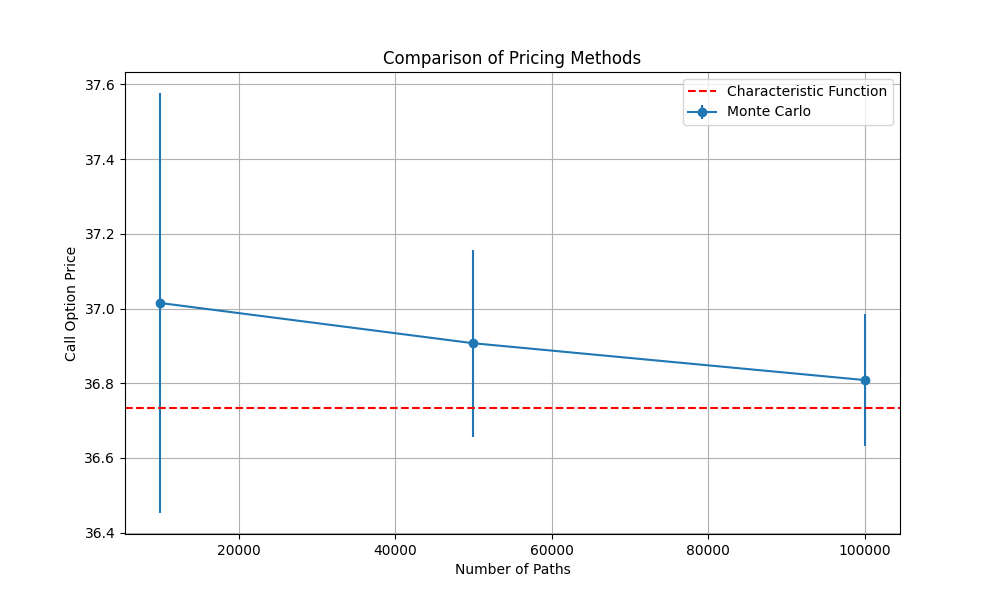

The figure above compares different pricing methods:
- Blue line with error bars: Monte Carlo prices
- Red dashed line: Result from the characteristic function method
- We see clear convergence (w.r.t. the number of simulation paths) of the Monte Carlo price to characteristic function price

### Implied Volatility Surface

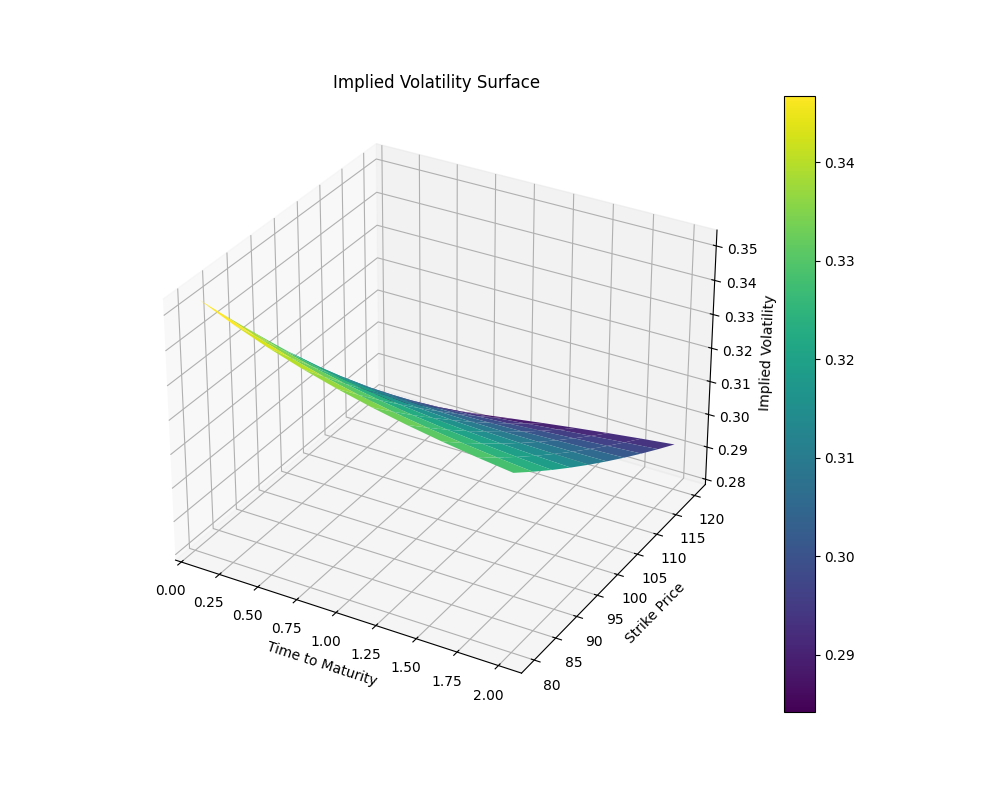

The 3D plot shows the Black Scholes implied volatility as a function of strike price and time to maturity treating the call option price from the Heston model as market data. The implied volatility decreases as a function of the strike price. 


## Dependencies and Setup

### Requirements
- Python 3.8+
- NumPy
- SciPy
- Matplotlib
- Seaborn
- statsmodels

### Installation
```bash
pip install -r requirements.txt
```

### Running Analysis
```bash
python src/main.py  # Generates all analyses and figures
```

## To do ...

1. Return distribution / ACF of the volatility itself (instead of price returns)

2. Improved Monte-carlo simulation for the variance process via the quadratic exponential discretization scheme of Leif Andersen (2006)

## References

1. Heston, S. L. (1993). "A Closed-Form Solution for Options with Stochastic Volatility with Applications to Bond and Currency Options"
2. Gatheral, J. (2006). "The Volatility Surface: A Practitioner's Guide"
3. Cont, R. (2001). "Empirical Properties of Asset Returns: Stylized Facts and Statistical Issues"
