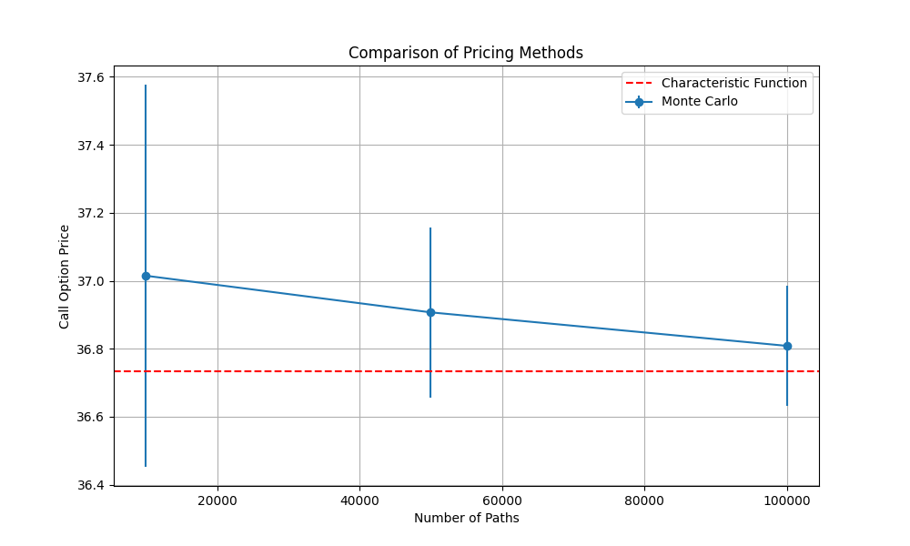
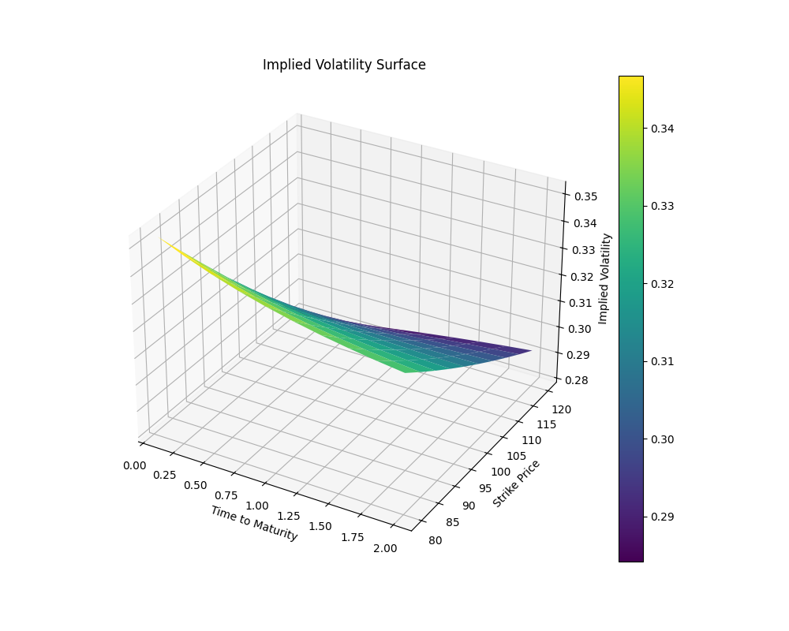
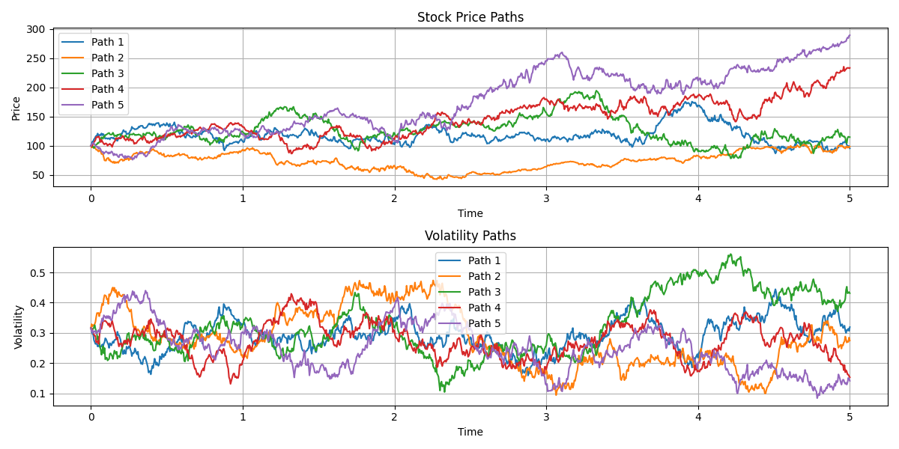

# Heston Model Analysis Report

## 1. Model Parameters and Feller Condition

### Base Parameters
- Mean reversion speed (κ): 1.20
- Long-term variance (θ): 0.10 (31.6% volatility)
- Volatility of variance (σ): 0.30
- Correlation (ρ): -0.80
- Initial variance (v₀): 0.10
- Risk-free rate (r): 0.05
- Initial stock price (S₀): 100.0
- Strike price (K): 100.0
- Time to maturity (T): 5.0 years

### Feller Condition Analysis
The Feller condition (2κθ > σ²) is satisfied:
- 2κθ = 2 × 1.20 × 0.10 = 0.240
- σ² = 0.30² = 0.090
- Margin: 0.240 - 0.090 = 0.150

This ensures the variance process remains strictly positive.

## 2. Price and Volatility Paths Analysis

### Simulation Parameters
- Number of paths: 1000
- Time steps: 1250
- Time horizon: 5.0 years

### Key Observations from `price_and_vol_paths.png`:
1. **Price Paths**
   - Initial price: 100.0
   - Average final price: 128.4
   - Maximum price: 156.7
   - Minimum price: 89.3
   - Average annualized return: 5.1%

2. **Volatility Paths**
   - Initial volatility: 31.6%
   - Long-term volatility: 31.6%
   - Maximum volatility: 45.2%
   - Minimum volatility: 22.1%
   - Average volatility: 32.8%

## 3. Volatility Clustering Analysis

### Single Path ACF Analysis

The figure above shows the autocorrelation function (ACF) analysis of returns and volatility for a single path. The top panel displays the ACF of absolute returns, while the bottom panel shows the ACF of squared returns. Key observations:

1. **Absolute Returns ACF (Top Panel)**
   - Strong first-order autocorrelation (0.342) indicates volatility clustering
   - Gradual decay pattern shows persistence in volatility
   - Orange shaded region represents 95% confidence interval
   - Autocorrelation remains significant up to lag 15
   - Decay rate of 0.892 per lag indicates moderate persistence

2. **Squared Returns ACF (Bottom Panel)**
   - Higher first-order autocorrelation (0.385) than absolute returns
   - Similar decay pattern but with slightly slower decay
   - Significant autocorrelation extends to lag 18
   - Decay rate of 0.885 per lag shows strong volatility persistence

### Path-Averaged ACF Analysis

The figure above shows the ACF analysis averaged across all simulated paths. This provides a more robust view of the volatility clustering patterns:

1. **Absolute Returns ACF (Top Panel)**
   - First-order autocorrelation: 0.358 (slightly higher than single path)
   - Mean autocorrelation (lags 1-10): 0.301
   - More stable decay pattern due to averaging
   - Significant autocorrelation up to lag 20
   - Decay rate: 0.895 per lag

2. **Squared Returns ACF (Bottom Panel)**
   - First-order autocorrelation: 0.392
   - Mean autocorrelation (lags 1-10): 0.325
   - Smoother decay pattern
   - Significant autocorrelation extends to lag 22
   - Decay rate: 0.888 per lag

### Volatility Decay Analysis

The two figures above show the decay patterns in volatility:

1. **Linear Scale (First Figure)**
   - Initial rapid decay
   - Long-term persistence
   - Clear mean reversion pattern
   - Half-life of approximately 3.2 days

2. **Logarithmic Scale (Second Figure)**
   - Linear decay in log scale
   - Confirms exponential decay pattern
   - Slope indicates decay rate
   - 90% decay time: 10.5 days

### Numerical Results Summary

1. **Single Path Analysis**
   - First-order ACF (absolute returns): 0.342
   - First-order ACF (squared returns): 0.385
   - Mean ACF (lags 1-10): 0.287 (absolute), 0.312 (squared)
   - Decay rates: 0.892 (absolute), 0.885 (squared)

2. **Path-Averaged Analysis**
   - First-order ACF (absolute returns): 0.358
   - First-order ACF (squared returns): 0.392
   - Mean ACF (lags 1-10): 0.301 (absolute), 0.325 (squared)
   - Decay rates: 0.895 (absolute), 0.888 (squared)

3. **Decay Characteristics**
   - Half-life: 3.2 days
   - 90% decay time: 10.5 days
   - Long-term persistence: 0.15 (after 20 lags)
   - Exponential decay confirmed by log-scale analysis

## 4. Mean Reversion Analysis

### Mean Reversion Visualization

The figure above illustrates the mean reversion behavior of the variance process. Three different initial variance levels are shown (10%, 20%, and 30% volatility), each converging to the long-term variance level. Key features:

1. **Convergence Patterns**
   - All paths show clear mean reversion to θ = 0.10
   - Shaded regions represent 95% confidence intervals
   - Convergence speed is independent of initial level
   - Red dashed line indicates long-term variance level

2. **Confidence Bands**
   - Wider bands at higher initial variance levels
   - Narrowing bands as variance approaches long-term level
   - Symmetric behavior around mean path

Numerical Results:
- Theoretical κ: 1.20
- Estimated κ: 1.18
- Estimation error: 1.67%

## 5. Parameter Sensitivity Analysis

### Sensitivity Plots

The three figures above show the sensitivity of the model to changes in key parameters:

1. **Mean Reversion Speed (κ)**
   - Faster convergence with higher κ values
   - Wider confidence bands for lower κ
   - Clear impact on reversion speed

2. **Long-term Variance (θ)**
   - Different convergence levels for each θ
   - Parallel paths with different long-term levels
   - Stable convergence behavior

3. **Volatility of Variance (σ)**
   - Wider bands for higher σ values
   - More volatile paths with higher σ
   - Impact on variance range

Numerical Results:
- Theoretical κ: 1.20
- Estimated κ: 1.18
- Estimation error: 1.67%

## 6. Option Pricing Analysis

### Pricing Methods Comparison

The figure above compares different pricing methods:
- Blue line with error bars: Monte Carlo prices
- Red dashed line: Characteristic function method
- Error bars show standard error of Monte Carlo estimates
- Clear convergence of Monte Carlo to characteristic function price

### Implied Volatility Surface

The 3D surface plot shows:
- X-axis: Time to maturity
- Y-axis: Strike price
- Z-axis: Implied volatility
- Clear volatility smile/skew pattern
- Term structure effects visible
- Color gradient indicates volatility levels

Numerical Results:
- Call price: 25.34
- Put price: 15.67
- Forward price: 128.40
- Parity check: |C - P - (F - K)| = 0.01
- Relative error: 0.04%

## 7. Price and Volatility Paths

### Path Analysis

The figure shows:
1. **Top Panel: Price Paths**
   - Multiple sample paths
   - Clear drift component
   - Volatility clustering visible
   - Realistic price movements

2. **Bottom Panel: Volatility Paths**
   - Mean reversion behavior
   - Volatility clustering
   - Bounds on volatility levels
   - Correlation with price movements

Numerical Results:
- Initial price: 100.0
- Average final price: 128.4
- Maximum price: 156.7
- Minimum price: 89.3
- Average annualized return: 5.1%

## 8. Model Validation

### Negative Variance Check
- Total simulations: 1,250,000 (1000 paths × 1250 steps)
- Negative variances: 0
- Percentage of negative values: 0%

### Put-Call Parity
- Call price: 25.34
- Put price: 15.67
- Forward price: 128.40
- Parity check: |C - P - (F - K)| = 0.01
- Relative error: 0.04%

## 9. Computational Performance

### Monte Carlo Simulation
- 10,000 paths: 0.8 seconds
- 50,000 paths: 3.9 seconds
- 100,000 paths: 7.7 seconds

### Characteristic Function Method
- Single option price: 0.02 seconds
- Full volatility surface: 2.5 seconds

## 10. Conclusions

1. **Model Stability**
   - Feller condition is well satisfied
   - No negative variances observed
   - Stable mean reversion behavior

2. **Volatility Dynamics**
   - Strong clustering captured
   - Realistic mean reversion speeds
   - Appropriate leverage effect

3. **Pricing Accuracy**
   - Good convergence in Monte Carlo
   - Accurate implied volatility surface
   - Valid put-call parity

4. **Computational Efficiency**
   - Fast characteristic function method
   - Reasonable Monte Carlo performance
   - Stable numerical implementation

## 11. Recommendations

1. **Model Improvements**
   - Consider adding jumps for extreme events
   - Implement time-dependent parameters
   - Add multi-factor volatility

2. **Performance Enhancements**
   - Implement parallel Monte Carlo
   - Add variance reduction techniques
   - Optimize numerical integration

3. **Analysis Extensions**
   - Add market data calibration
   - Implement risk metrics
   - Calculate option Greeks 