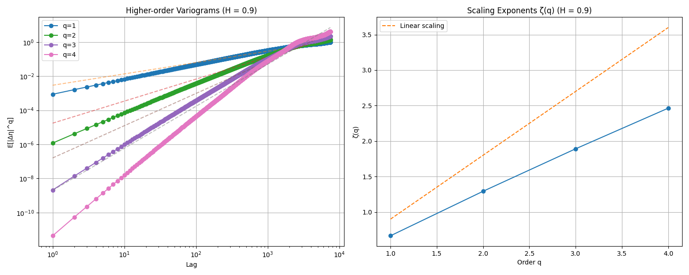

# Fractional Random Walk and Rough Volatility

This project implements and analyzes fractional random walks with applications to rough volatility in financial time series. The implementation is aimed towards addressing the stylized facts in the returns and volatility time series. We also aim to cover pricing of equity derivatives under rough volatility. 

## Setup

1. Create a virtual environment:
```bash
python3 -m venv venv
```

2. Activate the virtual environment:
```bash
source venv/bin/activate  # On Unix/macOS
```

3. Install dependencies:
```bash
pip install -r requirements.txt
```

These are:

- numpy
- matplotlib
- scipy

## Project Overview

1. Fractional Random Walk
   - Time series generation with different Hurst parameters (H)
   - Correlation function computation
   - Variogram analysis
   - Higher-moment variogram analysis

2. Price Returns and Rough Volatilities
   - Implementation of a simple model of price returns exhibiting rough volatility
   - Autocorrelation of absolute and squared returns 
   - Drawdown analysis
   - Return distribution properties
   - Correlation structure analysis
   - Price variogram analysis


## Fractional Random Walk

We impliment the Fractional random walk as following time series

$$
\eta_t=\sum_{k=1}^{N / 2} \alpha_k \cos (2 \pi k t / N)+\sum_{k=1}^{N / 2} \beta_k \sin (2 \pi k t / N)~,\qquad\qquad 
$$

where the variables $\alpha_k$ and $\beta_k$ are given by
$$
\alpha_k \sim \mathcal{N}(0, 1/k^{1+2H})~,\qquad \beta_k \sim \mathcal{N}(0, 1/k^{1+2H})~,\qquad k = 1,2, \cdots N/2~.
$$

The parameter $H$ is called the Hurst exponent and controls the 'roughness' of the time series. Values closer to 1 corresponds to smoother paths while values closer to 0 corresponds to rough paths. For $H=1/2$ one recovers the Browninan motion.  The plot below shows the $\eta_t$ time series for different values of the Hurst parameter $H$. 


Next we analyse the autocorrelation function of this time series that are shown in the plots below. 


### Autocorrelation plots

*Autocorrelation function for H=0.1*

*Autocorrelation function for H=0.3*

*Autocorrelation function for H=0.5*

*Autocorrelation function for H=0.7*

*Autocorrelation function for H=0.9*

Next we look at the variogram of this time series that measure how far does the process typically escape from itself between times $t$ and $t+\ell$. This quantity is defined by

$$
V(\ell) = \mathbb{E}[(\eta_t-\eta_{t-\ell})^2]~.
$$

If the process is a random walk, this quantity grows linearly with the separation $\ell$ (where the 
porportionality constant is volatility squared of the increments).

There is a regime where the variograms behaves like a power law in the lag ($\ell$). This regime is the one where we take $N\to \infty$ and then $\ell \to \infty$ (i.e. $1\ll \ell \ll N$). Working out $V(\ell)$ in this limit one find a power law behaviour $\sim \ell^{2H}$. This is depicted in the plots below


### Variogram plots


Below we also show higher order variograms $V_q(\ell) = \mathbb{E}[(\eta_t-\eta_{t-\ell})^q]$ for various Hurst parameters. 


*Higher order variograms for H=0.1*

*Higher order variograms for H=0.3*

*Higher order variograms for H=0.5*

*Higher order variograms for H=0.7*

*Higher order variograms for H=0.9*

## Rough Volatilities and Prices

The model of return that we have is 

$$
r_t:=p_{t+1}-p_t=\sigma \xi_t \exp \left(\gamma \eta_t-\gamma^2 \mathbb{E}\left[\eta_t^2\right]\right), \quad p_0=0
$$

Here

- $p_t$ is the price at time $t$
- $r_t$ is the return at time $t$
- $\sigma\xi_i \sim \mathcal{N}(0,\sigma^2)$ 
- $\gamma$ volatility of volatility

A simulation of the price process for various values of vol of vol $\gamma$ (with $H=0.1$ for the $\eta_t$ series) is shown in the figure below. We see that for higher values of $\gamma$ the price process is more intermittent. 


(*Price process for various value of vol of vol. One observes an intermittent behaviour in the price process for larger values of vol-of-vol parameter*)

In the plot below for the returns one observes that for larger $\gamma$ there are bigger more frequent jumps. 


(*Plot for the return process $r_t$ *)

### Lets look at the distribution of these return values below


(*Return distribution for $\gamma=0.0$*)


(*Return distribution for $\gamma=0.1$*)


(*Return distribution for $\gamma=0.2$*)


(*Return distribution for $\gamma=0.3$*)


(*Return distribution for $\gamma=0.4$*)


(*Return distribution for $\gamma=0.5$*)


(*Return distribution for $\gamma=0.6$*)

### Non-linear Autocorrelation functions and Volatility Clustering


(*Non-linear Autocorrelation function for $\gamma=0.0$. Dotted horizontal lines denote the 95% confidence interval.*)


(*Non-linear Autocorrelation function for $\gamma=0.1$ Dotted horizontal lines denote the 95% confidence interval*)


(*Non-linear Autocorrelation function for $\gamma=0.2$ Dotted horizontal lines denote the 95% confidence interval*)


(*Non-linear Autocorrelation function for $\gamma=0.3$ Dotted horizontal lines denote the 95% confidence interval*)


(*Non-linear Autocorrelation function for $\gamma=0.4$ Dotted horizontal lines denote the 95% confidence interval*)


(*Non-linear Autocorrelation function for $\gamma=0.5$ Dotted horizontal lines denote the 95% confidence interval*)


(*Non-linear Autocorrelation function for $\gamma=0.6$ Dotted horizontal lines denote the 95% confidence interval*)

When plotted against $\ell^{2H}$ the ACF of the absolute return shows approximately a linear relationship for small values of the lag parameter as can be seen below


(*Absolute return Autocorrelation function for $\gamma=0.1$*)


(*Absolute return Autocorrelation function for $\gamma=0.2$*)


(*Absolute return Autocorrelation function for $\gamma=0.3$*)


(*Absolute return Autocorrelation function for $\gamma=0.4$*)


(*Absolute return Autocorrelation function for $\gamma=0.5$*)


(*Absolute return Autocorrelation function for $\gamma=0.6$*)

### Price variograms

Below we show some plots of the price variograms defined as

$$
V_q = \mathbb{E}[|p_t-p_s|^q]~,
$$

for various values of $q$ and the vol-of-vol parameter $\gamma$. 


(*Price variogram for $\gamma=0.1$*)


(*Price variogram for $\gamma=0.2$*)


(*Price variogram for $\gamma=0.3$*)


(*Price variogram for $\gamma=0.4$*)


(*Price variogram for $\gamma=0.5$*)


(*Price variogram for $\gamma=0.6$*)


## Questions for future

1. Analysis of market data: Compute the variograms of log volatility of SPX and deduce the scaling behaviour $\sim \ell^{\zeta_q}$. Study the monofractal scaling relation 

$$
\zeta_q = q H~,
$$

from which the Hurst parameter $H$ can be deduced for the S&P 500 index. Repeat for a single stock and infer the Hurst parameter. 

2. Time dependence of the Hurst parameter.

3. Max drawdown analysis. 

3. Derivative pricing under Rough Volatility. For Options, how do the vol-of-vol parameter and the Hurst parameter affect prices. 

## References

1. J. Gatheral, T. Jaisson, and M. Rosenbaum, *Volatility is rough*

2. J. Gatheral, P. Jusselin and M. Rosenbaum, *The quadratic rough Heston model and the joint S&P 500/VIX smile calibration problem* 

3. C. Bayer, P. K. Friz, J. Gatheral, *Pricing under rough volatility*